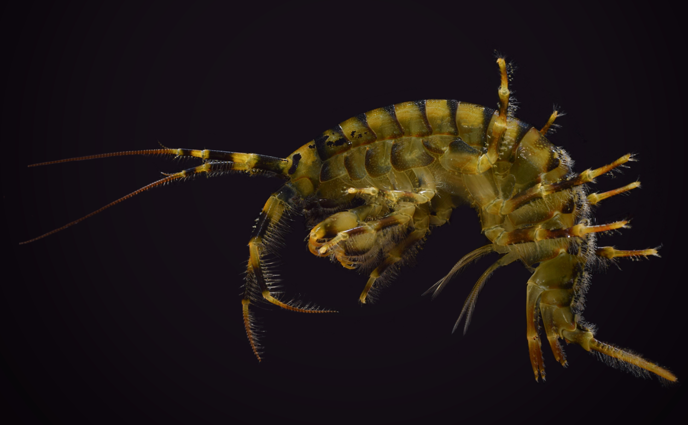
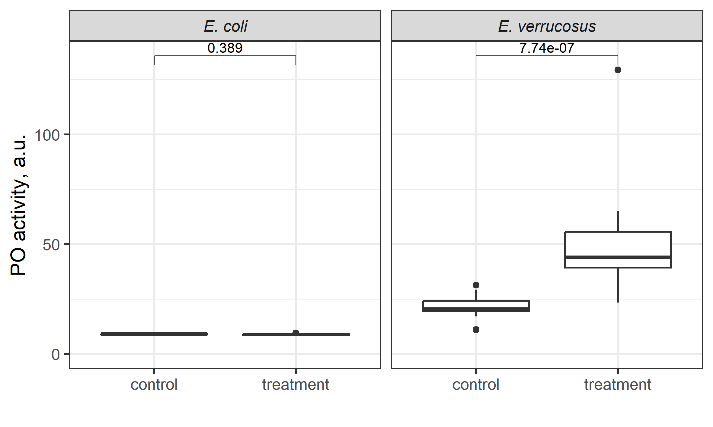
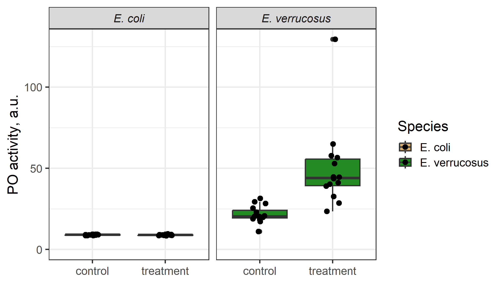
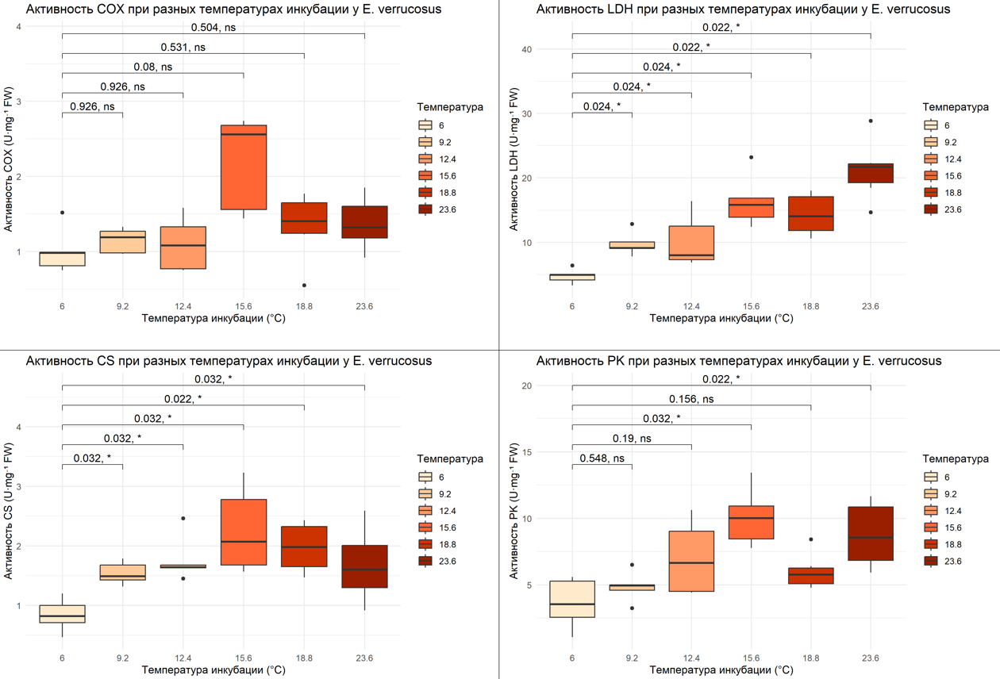
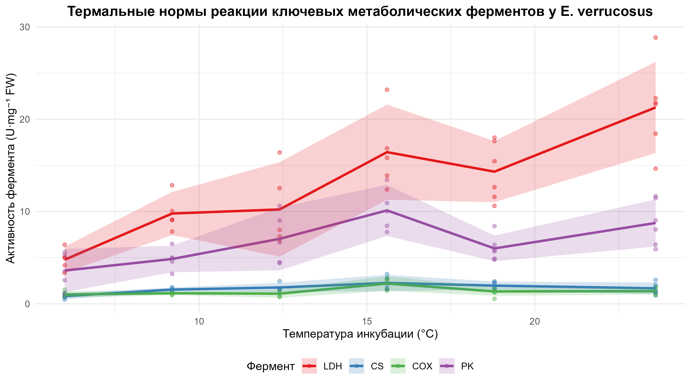

# Термальные нормы реакции ключевых метаболических ферментов у _Eulimnogammarus verrucosus_ (Jakob, 2021)
## Работа выполнена в рамках дисциплины "Воспроизводимые исследования в биологии":
## РЕЗЮМЕ
_Eulimnogammarus verrucosus_ (эулимногаммарус бородавчатый) – эндемичный вид амфипод озера Байкал. Впервые вид был описан Герстфельдом в 1858 году как _Gammarus verrucosus_, в 1874 году Б. И. Дыбовским перенесён в род _Eulimnogammarus_. Обитает на глубине воды от 0 до 25 м.

Критические температурные пороги для взрослых особей, определяемые по ограничениям в потреблении кислорода, составляют 14–15 °C, что значительно ниже, чем у его эвритермных родственников. Наблюдения также подтверждают его высокую чувствительность: при летнем прогреве литорали взрослые особи _E. verrucosus_ мигрируют из верхних слоёв (0–1.5 м) в более глубокие и холодные воды, избегая температурного стресса.

Данное исследование направлено на выявление молекулярно-биохимических основ этой уязвимости путём анализа активности ключевых метаболических ферментов (цитратсинтазы, цитохром-с-оксидазы, лактатдегидрогеназы и пируваткиназы) и экспрессии 300 рибосомальных генов в условиях постепенного потепления (0.8 °C/день), имитирующего сценарий климатических изменений.



Внешний вид объекта исследования. Источник фотографии: [https://festivalnauki.ru/media/articles/interesno-o-nauke/neizvedannyy-baykal/]

# Методы
`PuTTY v0.81`

`NCBI SRA Toolkit v3.0.0`

`Trinity RNA-Seq v2.14.0`

`R v4.3.2`

`tidyr`

`ggplot2`

`ggpubr`

`openxlsx`

`BiocManager`

`EnhancedVolcano`

`DESeq2`

`NCBI Blastn`
## Работа на удаленных серверах bash
### Основные команды bash

#### Базовая навигация по файловой системе:
`pwd` (print working directory) - показывает полный путь к текущей директории, в которой вы находитесь.

`cd` (change directory) - меняет текущую директорию. Опции: . = начало относительного пути, .. = на уровень выше, ~ = перейти в домашнюю директорию, / = разделитель уровней.

`ls` (list) - показывает содержимое текущей директории. Опции: h = удобное отображение размера, t = сортировка по размеру, j = отображение табличкой.

#### Работа с файлами:
`mkdir` (make directory) - создать пустую папку.

`cp` (copy) - копирует файлы. Опции: -r = работа с папкой. Пример, `cp file.txt PP_231` — копирует file.txt в PP_231.

`rm` (remove) - удаляет файлы и директории. Опции: -r = работа с папкой. Пример, `rm file.txt` - удаляет файл, `rm -r my_directory` - удаляет директорию/папку вместе с содержимым.

#### Просмотр и анализ файлов:
`cat` -  посмотреть весь файл.

`head` - покажет первые строки (по умолчанию 10). Опции: -n = количество строк. Пример, `head -n 20 file.txt` - покажет первые 20 строк.

`tail` - покажет конец файла.

`grep` - ищет текст по шаблону в файлах. Например, `grep "error" file.txt` - найдет все строки с словом "error" в файле.

#### Работа с процессами:
`ps` (process status) - показывает список запущенных процессов. Опции, `ps aux` - показывает все процессы с детальной информацией.

`kill` - посылает сигнал процессу для его завершения. Пример, `kill 1234`, где 1234 - это ID процесса.

`screen` - запуск длительных процессов. Опции: -S "ИМЯ" = создать процесс, Ctrl+A+D - выход из процесса, -r "ИМЯ" = вернуться, -ls = показать список процессов.

#### Сетевые команды:
`wget` - скачивает файлы из интернета прямо на сервер. Пример, `wget https://example.com/file.zip`.


### Скачивание данных
_Показываем, где находится исполняемый файл программы sratoolkit:_

`export PATH=$PATH:/media/secondary/apps/sratoolkit.3.0.0-ubuntu64/bin/`

_Скачиваем данные (Eulimnogammarus verrucosus):_

`fasterq-dump --threads 2 -A --progress SRR8205839 ; fasterq-dump --threads 2 -A --progress SRR8205845 ; fasterq-dump --threads 2 -A --progress SRR8205840 ; fasterq-dump --threads 2 -A --progress SRR8205846 ; fasterq-dump --threads 2 -A --progress SRR8205838 ; fasterq-dump --threads 2 -A --progress SRR8206022 ; fasterq-dump --threads 2 -A --progress SRR8206023 ; fasterq-dump --threads 2 -A --progress SRR8205837`


### Выравнивание чтений на референс
_Скачивание референса:_

`wget https://ftp.ncbi.nlm.nih.gov/geo/series/GSE129nnn/GSE129069/suppl/GSE129069%5FEveBCdTP1%5Fani%2Efasta%2Egz`

_Распаковка архива:_

`gunzip GSE129069_EveBCdTP1_ani.fasta.gz`

_Показываем, где находится исполняемый файл программы trinityrnaseq:_

`export PATH=$PATH:/media/secondary/apps/trinityrnaseq-v2.14.0/util/`

_Подготовка референса:_

`lign_and_estimate_abundance.pl --transcripts GSE129069_EveBCdTP1_ani.fasta --est_method salmon --trinity_mode --prep_reference`

_Скачивание таблицы образцов:_

`wget https://raw.githubusercontent.com/drozdovapb/Reproducible_research/refs/heads/main/Data/Eve_samples.txt`

_Выравнивание с помощью Salmon:_

`align_and_estimate_abundance.pl --transcripts GSE129069_EveBCdTP1_ani.fasta --seqType fq --samples_file Eve_samples.txt --est_method salmon --trinity_mode --output_dir . --thread_count 2 --SS_lib_type FR`

### Построение графиков в R:
#### Загрузка файлов:
_Установка рабочей директории (место на диске, где находятся файлы для анализа):_

`setwd("C:/Users/epifa/Учёба/Магистратура 1 курс/Воспроизводимые исследования в биологии")`

_Загрузка библиотек:_

`install.packages("openxlsx")`

`library(openxlsx)`

_Загрузка файлов:_

`tbl <- read.xlsx("Test_table_2.xlsx", sheet = 2)`

#### Проверка файлов:
_Числа являются числами:_

`str(tbl)`

_Диапазон значений соответствует ожидаемому:_

`hist(tbl$PO.activity)`

`hist(tbl$Hemocyte.count)`

_Факторы: одинаковое написание:_

`unique(tbl$Species)`

_Подготовка необходимых пакетов:_
```
if (!("ggplot2" %in% installed.packages())) install.packages("ggplot2")
library(ggplot2)
if (!("ggpubr" %in% installed.packages())) install.packages("ggpubr")`
library(ggpubr)
```
#### Построение графиков (на примере Po activity):
 ```
 plot <-ggplot(data=tbl, aes(x=Group, y=PO.activity)) +
  expand_limits(y=0) + #y=0 включаем
  geom_boxplot(show.legend = FALSE) + #боксплоты (без легенды)
  facet_wrap(~Species) + #панели по видам
  ylab("PO activity, a.u.") + xlab("") + #название оси Y
  theme_bw(base_size = 16) + #увеличим размер шрифта + белый фон
  theme(strip.text = element_text(face="italic")) + #курсив
  geom_pwc(method = "wilcox_test", label="p.adj") #добавление статистических тестов
plot #вывод графика
ggsave("PO_with_stats.png", device=png, width=20, height=12, units="cm") #сохранение в файл
```
 

#### Дополнительные скрипты (заливка и отображение значений)
```
plot.PO1 <- ggplot(data=tbl, 
       aes(x=Group, y=PO.activity, fill=Species)) + #добавляем заливку по виду (fill=Species)
  expand_limits(y=0) +
  geom_boxplot(show.legend = TRUE) +
  scale_fill_manual(values=c("#D2AA6D", "forestgreen")) + #указываем цвета (RGB или имя)
  facet_wrap(~Species) +
  geom_jitter(width = 0.1) + #точки значений
  ylab("PO activity, a.u.") + 
  xlab("") +
  theme_bw(base_size = 16) +
  theme(strip.text = element_text(face="italic"))
```



#### Построение графиков термальной нормы реакции активности ключевых метаболических ферментов: лактатдегидрогеназы (LDH), цитратсинтазы (CS), цитохром-c-оксидаза (COX) и пируваткиназы (PK) у _E. verrucosus_ (Jakob et al, 2021)
```
Jakob <- read.xlsx("Jakob-etal_2021.xlsx", startRow = 2)
temp_colors_orange <- c("6" = "#ffebcc",
                        "9.2" = "#ffcc99",
                        "12.4" = "#ff9966",
                        "15.6" = "#ff6633",
                        "18.8" = "#cc3300",
                        "23.6" = "#991f00") # Определяем цвета для каждой температуры (6 значений)
ggplot(Jakob, 
       aes(x = factor(`Incubation.temperature.(°C)`), 
           y = `LDH.activity.(U.mg.(FW)-1)`,
           fill = factor(`Incubation.temperature.(°C)`))) +  # Добавляем fill!
  geom_boxplot() +
  scale_fill_manual(values = temp_colors_orange) +  # Применяем цвета
  geom_pwc(method = "wilcox_test", 
           label = "{p.adj}, {p.adj.signif}", 
           p.adjust.method = "holm", 
           ref.group = 1) +
  labs(title = "Активность LDH при разных температурах инкубации у E. verrucosus",
       x = "Температура инкубации (°C)", 
       y = "Активность LDH (U·mg⁻¹ FW)",
       fill = "Температура") +  # Название легенды
  theme_minimal() +
  theme(legend.position = "right")  # Легенда справа`
ggsave(filename="LDH_activ.png", device=png, width=18, height=12, units="cm", dpi=300) # сохраняем полученный результат
```

#### Далее по аналогии  меняем в строчке `y = LDH.activity.(U.mg.(FW)-1)` значение y на `CS.activity.(U.mg.(FW)-1)`, `COX.activity.(U.mg.(FW)-1)` и `PK.activity.(U.mg.(FW)-1)` соответственно.



#### Построение общего графика термальной нормы реакции активности ключевых метаболических ферментов с ДИ 95%
```
# задаем рабочую директорию (где находятся файлы для анализа)
setwd("C:\\Users\\epifa\\Учёба\\Магистратура 1 курс\\Воспроизводимые исследования в биологии\\RR5_data")

# подготавливаем пакеты для работы
if (!("openxlsx" %in% installed.packages())) install.packages("openxlsx")
library(openxlsx)
if (!("ggplot2" %in% installed.packages())) install.packages("ggplot2")
library(ggplot2)
if (!("ggpubr" %in% installed.packages())) install.packages("ggpubr")
library(ggpubr)
if (!("tidyr" %in% installed.packages())) install.packages("tidyr")
library(tidyr)

Jakob <- read.xlsx("Jakob-etal_2021.xlsx", startRow = 2) # загружаем данные для анализа

# Преобразуем данные из широкого формата в длинный
Jakob_long <- pivot_longer(
  Jakob,
  cols = c(`LDH.activity.(U.mg.(FW)-1)`, `CS.activity.(U.mg.(FW)-1)`, 
           `COX.activity.(U.mg.(FW)-1)`, `PK.activity.(U.mg.(FW)-1)`),# выбираем столбцы для преобразования
  names_to = "Enzyme", # задаем имя нового столбца для названия ферментов
  values_to = "Activity" # задаем имя нового столбца для активности ферментов
)

# Переименовываем ферменты для удобства (через преобразования текста в фактор)
Jakob_long$Enzyme <- factor(Jakob_long$Enzyme, 
                            levels = c("LDH.activity.(U.mg.(FW)-1)", "CS.activity.(U.mg.(FW)-1)",
                                       "COX.activity.(U.mg.(FW)-1)", "PK.activity.(U.mg.(FW)-1)"), # старые названия
                            labels = c("LDH", "CS", "COX", "PK") # новые названия в том же порядке, что и старые
)

# Создаем цветовую палитру для ферментов
enzyme_colors <- c(
  "LDH" = "#E41A1C",
  "CS" = "#377EB8",
  "COX" = "#4DAF4A",
  "PK" = "#984EA3"
)

# Строим график
plot_1 <- ggplot(Jakob_long, 
            aes(x = `Incubation.temperature.(°C)`, # задаем ось x
                y = Activity, # задаем ось y
                color = Enzyme, # цвет соответствует ферменту
                group = Enzyme)) + # группировка для построения линий
  geom_point(alpha = 0.4, size = 1.5) + # задаем уровень прозрачности и размер точек
  
  # Создаем линии по средним значениям
  stat_summary(
    fun = mean, # вычисляем среднее
    geom = "line", # выбираем геометрию: линию
    linewidth=1.2, # толщина линии
    aes(group = Enzyme) # группировка по ферменту
  ) +
  # Вычисляем дов. интервалы (95)
  stat_summary(
    fun.data = mean_cl_normal,# среднее + 95% ДИ (норм. распред)
    geom = "ribbon", # выбираем геометрию: ленту
    aes(fill = Enzyme), # заливка по ферменту
    alpha = 0.2, #прозрачность
    color = NA #без границ
  ) +
  # Настройка цветов
  scale_color_manual(values = enzyme_colors) + #применяем ранее созданную палитру enzyme_colors к линиям
  scale_fill_manual(values = enzyme_colors) + #применяем ранее созданную палитру enzyme_colors к ДИ
  # Названия осей и легенды
  labs(
    title = "Термальные нормы реакции ключевых метаболических ферментов у E. verrucosus", # название графика
    x = "Температура инкубации (°C)", # название оси x
    y = "Активность фермента (U·mg⁻¹ FW)", #название оси y
    color = "Фермент",
    fill = "Фермент"
  ) +

  theme_minimal(base_size = 12) + # базовый размер шрифта 12
  theme(
    legend.position = "bottom", # положение легенды
    plot.title = element_text(face = "bold", hjust = 0.5) # жирный заголовок по центру
  )

# Сохранение графика
ggsave(filename = "Enzymes_activ.png", plot = plot_1, width = 25, height = 14, units = "cm", dpi = 300)
```

Линии показывают средние значения, затененные области - 95% доверительные интервалы

### Анализ дифференциальной экспрессии генов (ДЭГ)
#### Скачивание данных с удаленного сервера

`export PATH=$PATH:/media/secondary/apps/trinityrnaseq-v2.14.0/util`

`abundance_estimates_to_matrix.pl --est_method salmon --gene_trans_map none \--name_sample_by_basedir --out_prefix Eve --cross_sample_norm none \Eve*/quant.sf`

#### Анализ в R
```
# Установка рабочей директории
setwd("C:\\Users\\epifa\\Учёба\\Магистратура 1 курс\\Воспроизводимые исследования в биологии\\RR5_data")

# Установка и загрузка необходимых пакетов
install.packages("BiocManager")
BiocManager::install("EnhancedVolcano")
BiocManager::install("DESeq2")

library(DESeq2)
library(EnhancedVolcano)
library(openxlsx)

# Загрузка данных
count_table <- read.table("Eve.isoform.counts.matrix")
count_table <- round(count_table)
sample_table <- data.frame(conditions=c("control", "control", "control", "control",
                                        "heat_shock", "heat_shock", "heat_shock"))

# Анализ ДЭ
ddsFullCountTable <- DESeqDataSetFromMatrix(
  countData = count_table, colData = sample_table, design = ~ conditions)
dds <- DESeq(ddsFullCountTable)
res <- results(dds)

top_n <- 20  # Количество генов для отображения
top_genes <- rownames(res)[order(res$padj)][1:top_n] # сортировка и выбор топ-20 ДЭГ


# Визуализация данных
EnhancedVolcano(res,
                lab = rownames(res),
                x = 'log2FoldChange', #
                y = 'pvalue',
                pCutoff = 0.05, # p-value
                pCutoffCol = 'padj', # скорректированное p-value
                FCcutoff = 1, # порог изменения экспрессии
                title = paste("Топ-20 ДЭГ"),
                subtitle = "E. verrucosus: heat shock vs control",
                col = c("grey30", "green", "blue", "red2"),
                labSize = 5, # размер текста
                labCol = 'black', # цвет текста
                boxedLabels = TRUE, # рамка вокруг подписей
                drawConnectors = TRUE, # соед. линии
                widthConnectors = 0.5, # толщина линий
                colConnectors = 'grey50', # цвет линий
                max.overlaps = 100,   
                selectLab = top_genes, # подписывать только топ-20
                xlab = bquote(~Log[2]~" Fold Change"),# подпись оси x
                ylab = bquote(~-Log[10]~italic(p)), # подпись оси y
                legendPosition = 'right') # положение легенды

# Сохранение графика
ggsave("Volcano_plot.png", 
       width = 50, height = 30, units = "cm", dpi = 300)

# Сортировка и запись данных (xlsx)
DEGs <- res[abs(res$log2FoldChange) > 2 & res$padj < 0.05 & complete.cases(res$padj), ]
DEGs <- DEGs[order(DEGs$log2FoldChange), ]`
DEGs$Transcript <- row.names(DEGs)
write.xlsx(x = DEGs, file = "DEGs_amphipods.xlsx")
```
 

 #### Аннотация генов
 
 Чтобы получить адекватные названия генов, а не технические идентификаторы Trinity, необходимо аннотировать гены.
 Предварительно нужно узнать какая последовательность скрывается за Trinity ID.
 Последовательно можно узнать на удаленном сервере, где хранится fasta-файл (GSE129069_EveBCdTP1_ani.fasta)
 
 `grep TRINITY_DN366819_c0_g1_i7 GSE129069_EveBCdTP1_ani.fasta -A 1`

 Далее скопированную с удаленного сервера последовательность необходимо аннотироваеть в BLASTn [https://blast.ncbi.nlm.nih.gov/Blast.cgi?PROGRAM=blastn&PAGE_TYPE=BlastSearch&LINK_LOC=blasthome].

