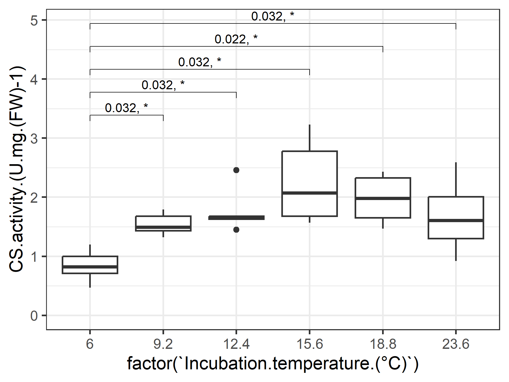
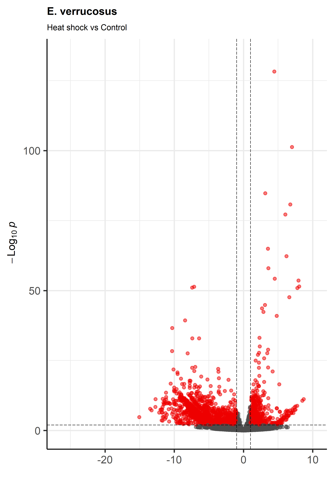

# Работа на удаленных серверах bash и анализ в R в рамках дисциплины "Воспроизводимые исследования в биологии":
## Основные команды bash

#### Базовая навигация по файловой системе:
`pwd` (print working directory) - показывает полный путь к текущей директории, в которой вы находитесь.

`cd` (change directory) - меняет текущую директорию. Опции: . = начало относительного пути, .. = на уровень выше, ~ = перейти в домашнюю директорию, / = разделитель уровней.

`ls` (list) - показывает содержимое текущей директории. Опции: h = удобное отображение размера, t = сортировка по размеру, j = отображение табличкой.

#### Работа с файлами:
`mkdir` (make directory) - создать пустую папку.

`cp` (copy) - копирует файлы. Опции: -r = работа с папкой. Пример, `cp file.txt PP_231` — копирует file.txt в PP_231.

`rm` (remove) - удаляет файлы и директории. Опции: -r = работа с папкой. Пример, `rm file.txt` - удаляет файл, `rm -r my_directory` - удаляет директорию/папку вместе с содержимым.

#### Просмотр и анализ файлов:
`cat` -  посмотреть весь файл.

`head` - покажет первые строки (по умолчанию 10). Опции: -n = количество строк. Пример, `head -n 20 file.txt` - покажет первые 20 строк.

`tail` - покажет конец файла.

`grep` - ищет текст по шаблону в файлах. Например, `grep "error" logfile.txt` — найдет все строки с словом "error" в файле.

#### Работа с процессами:
`ps` (process status) - показывает список запущенных процессов. Опции, `ps aux` — показывает все процессы с детальной информацией.

`kill` - посылает сигнал процессу для его завершения. Пример, `kill 1234`, где 1234 - это ID процесса.

`screen` - запуск длительных процессов. Опции: -S "ИМЯ" = создать процесс, Ctrl+A+D - выход из процесса, -r "ИМЯ" = вернуться, -ls = показать список процессов.

#### Сетевые команды:
`wget` - скачивает файлы из интернета прямо на сервер. Пример, `wget https://example.com/file.zip`.

## Скачивание данных
_Показываем, где находится исполняемый файл программы:_
`export PATH=$PATH:/media/secondary/apps/sratoolkit.3.0.0-ubuntu64/bin/`

_Скачиваем данные (Eulimnogammarus verrucosus):_
`fasterq-dump --threads 2 -A --progress SRR8205839 ; fasterq-dump --threads 2 -A --progress SRR8205845 ; fasterq-dump --threads 2 -A --progress SRR8205840 ; fasterq-dump --threads 2 -A --progress SRR8205846 ; fasterq-dump --threads 2 -A --progress SRR8205838 ; fasterq-dump --threads 2 -A --progress SRR8206022 ; fasterq-dump --threads 2 -A --progress SRR8206023 ; fasterq-dump --threads 2 -A --progress SRR8205837`

## Выравнивание чтений на референс
_Скачивание референса:_
`wget https://ftp.ncbi.nlm.nih.gov/geo/series/GSE129nnn/GSE129069/suppl/GSE129069%5FEveBCdTP1%5Fani%2Efasta%2Egz`

_Распаковка архива:_
`gunzip GSE129069_EveBCdTP1_ani.fasta.gz`

_Прописывание пути к программе:_
`export PATH=$PATH:/media/secondary/apps/trinityrnaseq-v2.14.0/util/`

_Подготовка референса:_
`lign_and_estimate_abundance.pl --transcripts GSE129069_EveBCdTP1_ani.fasta --est_method salmon --trinity_mode --prep_reference`

_Скачивание таблицы образцов:_
`wget https://raw.githubusercontent.com/drozdovapb/Reproducible_research/refs/heads/main/Data/Eve_samples.txt`

_Выравнивание с помощью Salmon:_
`align_and_estimate_abundance.pl --transcripts GSE129069_EveBCdTP1_ani.fasta --seqType fq --samples_file Eve_samples.txt --est_method salmon --trinity_mode --output_dir . --thread_count 2 --SS_lib_type FR`

## Построение графиков в R:
### Загрузка файлов:
_Установка рабочей директории:_
`setwd("C:/Users/epifa/Учёба/Магистратура 1 курс/Воспроизводимые исследования в биологии")`

_Загрузка библиотек:_
`library(openxlsx)`

_Загрузка файлов:_
`tbl <- read.xlsx("Test_table2.xlsx", sheet = 2)`

### Проверка файлов:
_Числа являются числами:_
`str(tbl)`

_Диапазон значений соответствует ожидаемому:_
`hist(tbl$PO.activity)`
`hist(tbl$Hemocyte.count)`

_Факторы: одинаковое написание:_
`unique(tbl$Species)`

_Подготовка необходимых пакетов:_
`if (!("ggplot2" %in% installed.packages())) install.packages("ggplot2")`
`library(ggplot2)`

`if (!("ggpubr" %in% installed.packages())) install.packages("ggpubr")`
`library(ggpubr)`

### Построение графиков (на примере Po activity):
 `plot <- ggplot(data=tbl, aes(x=Group, y=PO.activity)) +
  expand_limits(y=0) + #y=0 включаем
  geom_boxplot(show.legend = FALSE) + #боксплоты (без легенды)
  facet_wrap(~Species) + #панели по видам
  ylab("PO activity, a.u.") + xlab("") + #название оси Y
  theme_bw(base_size = 16) + #увеличим размер шрифта + белый фон
  theme(strip.text = element_text(face="italic")) + #курсив
  geom_pwc(method = "wilcox_test", label="p.adj") #добавление статистических тестов`

`plot #вывод графика`

`ggsave("PO_with_stats.png", device=png, width=20, height=12, units="cm") #сохранение в файл`

 

### Дополнительные скрипты
`plot.PO1 <- ggplot(data=tbl, 
       aes(x=Group, y=PO.activity, fill=Species)) + #добавляем заливку по виду (fill=Species)
  expand_limits(y=0) +
  geom_boxplot(show.legend = TRUE) +
  scale_fill_manual(values=c("#D2AA6D", "forestgreen")) + #указываем цвета (RGB или имя)
  facet_wrap(~Species) +
  geom_jitter(width = 0.1) + #точки значений
  ylab("PO activity, a.u.") + 
  xlab("") +
  theme_bw(base_size = 16) +
  theme(strip.text = element_text(face="italic"))`

### Построение графика из статьи (Jakob et al, 2021)
`Jakob <- read.xlsx("Jakob-etal_2021.xlsx", startRow = 2)
ggplot(Jakob, 
       aes(x=factor(`Incubation.temperature.(°C)`), y=`CS.activity.(U.mg.(FW)-1)`)) +
  geom_boxplot()
  geom_pwc(method="wilcox_test", label = "{p.adj}, {p.adj.signif}", 
           p.adjust.method = "holm", ref.group = 1)
ggsave(filename="CS_activ.png", device=png, width=16, height=12, units="cm", dpi=300)`

## Анализ дифференциальной экспрессии в R
_Скачивание файла с удаленного сервера_
`export PATH=$PATH:/media/secondary/apps/trinityrnaseq-v2.14.0/util`
`abundance_estimates_to_matrix.pl --est_method salmon --gene_trans_map none \--name_sample_by_basedir --out_prefix Eve --cross_sample_norm none \Eve*/quant.sf`

## Анализ в R
_Установка пакетов в R:_
`install.packages("BiocManager")`
`BiocManager::install("EnhancedVolcano")`
`BiocManager::install("DESeq2")`

_Загрузка библиотек:_
`library(DESeq2)`
`library(EnhancedVolcano)`
`library(openxlsx)`

_Загружаем данные в R:_
`count_table <- read.table("Eve.isoform.counts.matrix")`
`count_table <- round(count_table)`
`sample_table <- data.frame(conditions=c("control", "control", "control", "control",
                                    "heat_shock", "heat_shock", "heat_shock"))`
`ddsFullCountTable <- DESeqDataSetFromMatrix(
  countData = count_table, colData = sample_table, design = ~ conditions)`
`dds <- DESeq(ddsFullCountTable)`
`res <- results(dds)`

_Визуализация данных:_
`EnhancedVolcano(res, lab = rownames(res),
 x = 'log2FoldChange', y = 'pvalue',
 pCutoff=0.05, pCutoffCol = 'padj', FCcutoff = 1,
 title="Large Title", subtitle="Subtitle",
 col = c("grey30", "grey30", "grey30", "red2"),
 xlab="", ylab = bquote(~-Log[10] ~ italic(p)),
 caption="", selectLab = "", legendPosition = 'none')`

 

_Сортировка и запись данных (xlsx):_
`DEGs <- res[abs(res$log2FoldChange) > 2 & res$padj < 0.05 & complete.cases(res$padj), ]`
`DEGs <- DEGs[order(DEGs$log2FoldChange), ]`
`DEGs$Transcript <- row.names(DEGs)`
`write.xlsx(x = DEGs, file = "DEGs_amphipods.xlsx")`

